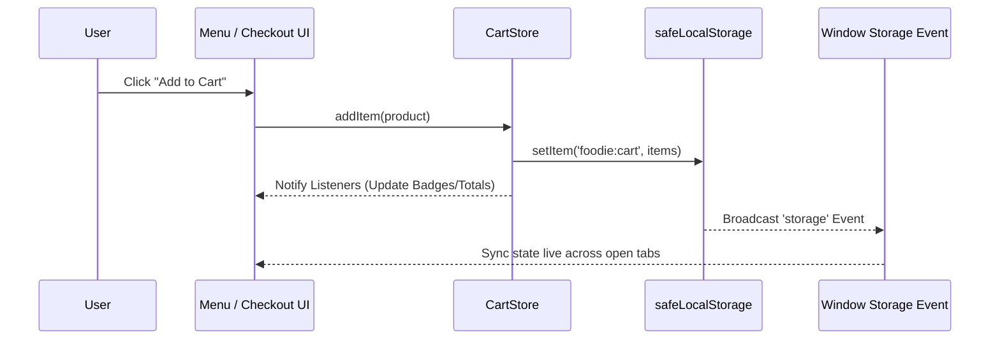

# Foodie — System Architecture, i18n Schema & Wrangler Deployment Specification

## 1. Overview
**Foodie** is a client-side food delivery and ordering web application built with Vanilla HTML5, CSS3, and JavaScript (ES6+). It features multi-language translation (English and Hindi), theme customization, offline PWA capabilities, and Cloudflare Pages/Workers serverless deployment.

---

## 2. Cloudflare Wrangler Deployment Guide

Foodie uses **Cloudflare Wrangler** for serverless Workers/Pages deployment.

### 2.1 Prerequisites
Ensure Wrangler CLI is installed:
```bash
npm install -g wrangler
```

### 2.2 Local Development Preview
Run local edge preview server:
```bash
npm run preview
```

### 2.3 Cloudflare Deployment
Deploy to Cloudflare edge:
```bash
npm run deploy
```

---

## 3. i18n Translation Schema & Structure

Translation files reside in `locales/`:
- `locales/en.json` (Primary English catalog)
- `locales/hi.json` (Hindi translation catalog)

### 3.1 Translation JSON Key Format
```json
{
  "nav": {
    "home": "Home",
    "menu": "Menu",
    "favorites": "Favorites"
  },
  "auth": {
    "welcomeBack": "Welcome back, {name}!"
  }
}
```

---

## 4. System Components Architecture

```
Foodie Architecture
├── UI Layer (HTML5, Vanilla CSS, FontAwesome)
├── State Layer (CartStore, safeLocalStorage, IndexedDB)
├── i18n Engine (i18n.js, MutationObserver, Locales JSON)
└── Edge Layer (Cloudflare Workers, Wrangler API)
```
# Foodie — Technical Architecture & Specification

## 1. Overview
**Foodie** is a modern, responsive, client-side web application for food discovery, restaurant browsing, and online order management. Built with Vanilla HTML5, CSS3, JavaScript (ES6+), and lightweight internationalization, Foodie offers real-time cart handling, multi-language support (English and Hindi), theme customization, offline PWA capabilities, and an active order tracking workflow.

---

## 2. Directory & Workspace Structure

```
Foodie/
├── css/                     # Styling stylesheets
│   ├── style.css            # Primary global styles and typography
│   ├── dark-mode.css        # Theme variables & dark mode overrides
│   ├── responsive.css       # Media queries and mobile breakpoint rules
│   └── order-history.css    # Order history & status modal styles
├── js/                      # Application JavaScript modules
│   ├── app.js               # Main application bootstrapper & global bindings
│   ├── auth.js              # User authentication & session handling
│   ├── cart-store.js        # Reactive cart state management & cross-tab sync
│   ├── search.js            # Client-side inverted search index & filters
│   ├── i18n.js              # Internationalization & translation engine
│   ├── utils.js             # Performance & safety helper utilities
│   ├── error-handler.js     # Custom error classes, logger & circuit breaker
│   ├── order-history.js     # Order receipt rendering & tracking modal
│   ├── footer.js            # Dynamic footer injection & translation observer
│   └── nearbyres.js         # Nearby restaurant discovery module
├── html/                    # Application HTML pages
│   ├── index.html           # Home landing page
│   ├── menu.html            # Food menu catalog with category search
│   ├── checkout.html        # Multi-step checkout & payment processing
│   ├── order-history.html   # User order history & timeline tracking
│   ├── login.html           # User login & guest demo mode
│   ├── signup.html          # User registration portal
│   ├── special-dishes.html  # Featured chef specials catalog
│   ├── popular.html         # Trending dishes overview
│   ├── category.html        # Category filter view
│   ├── aboutUs.html         # About Us company page
│   ├── contactUs.html       # Contact form & support portal
│   └── supportCenter.html   # FAQ & assistance portal
├── locales/                 # i18n Translation catalogs
│   ├── en.json              # English translation key-value map
│   └── hi.json              # Hindi translation key-value map
├── chrome extension/        # Chrome Extension (Manifest V3)
│   ├── manifest.json        # Extension configuration & permissions
│   ├── popup.html           # Extension status UI
│   ├── popup.js             # Active order status & cart listener
│   └── popup.css            # Extension styling tokens
├── tests/                   # Jest unit & integration test suite
│   ├── app.test.js          # App lifecycle unit tests
│   └── auth.test.js         # Authentication unit tests
├── products.json            # Main product catalog dataset
├── package.json             # NPM dependencies & test scripts
└── ARCHITECTURE.md          # Technical Architecture & System Guide
```

---

## 3. Core Architecture Patterns

### 3.1 Reactive Cart Store (`js/cart-store.js`)
Foodie uses a centralized Observer-pattern state store for shopping cart operations:
- **State Storage**: Cart items are persisted safely using `safeLocalStorage` to prevent browser quota exceptions.
- **Cross-Tab Synchronization**: Listens for window `storage` events to synchronize cart badge counters and total prices live across multiple open browser tabs.
- **Calculation Precision**: Uses `Math.round((total + Number.EPSILON) * 100) / 100` to prevent floating-point accuracy bugs during tax and total calculations.



### 3.2 Error Handling & Performance System (`js/utils.js` & `js/error-handler.js`)
- **Event Throttling & Debouncing**: Scroll events use `throttle` (100ms) to maintain 60fps performance; search inputs use `debounce` (300ms) to minimize DOM reflows.
- **Circuit Breaker Pattern**: Network operations wrapped in `CircuitBreaker` to prevent repeated cascading network requests upon failure.
- **Global Error Logging**: Captures unhandled rejections and runtime exceptions into `errorLogger` with persistent client logs.

### 3.3 Internationalization Engine (`js/i18n.js`)
- **Fallback Chain**: Resolves keys in selected language -> falls back to `en.json` -> displays fallback string if key is unmapped.
- **DOM Binding**: Uses `data-i18n` HTML attributes for inline text replacement.
- **Dynamic Mutation Observer**: Listens for DOM insertions (such as dynamic menu items or toast notifications) and auto-applies translation mappings.

---

## 4. Security & Storage Guidelines

1. **Authentication Persistence**: Session tokens and user profiles are stored in browser local storage. Passwords must be hashed using Web Crypto API (`SHA-256`) prior to storage.
2. **HTML Sanitization**: User-submitted feedback, reviews, and inputs are passed through `escapeHTML()` in `utils.js` before DOM insertion to mitigate XSS vulnerabilities.
3. **Safe Storage Wrappers**: All storage reads and writes utilize `safeLocalStorage` wrappers to catch `QuotaExceededError` gracefully.

---

## 5. Development & Testing Workflow

### 5.1 Local Setup
1. Clone repository:
   ```bash
   git clone https://github.com/janavipandole/Foodie.git
   cd Foodie
   ```
2. Install dev dependencies:
   ```bash
   npm install
   ```

### 5.2 Running Tests
Execute the Jest test suite:
```bash
npm test
```

### 5.3 Local Development Server
Serve static files using any local web server (e.g. VS Code Live Server or python `http.server`):
```bash
python -m http.server 8000
```
Open `http://localhost:8000` in browser.
